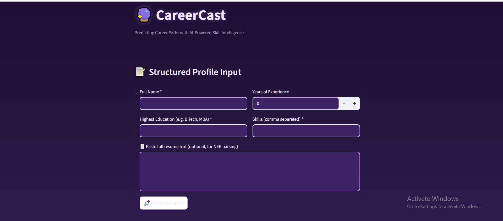
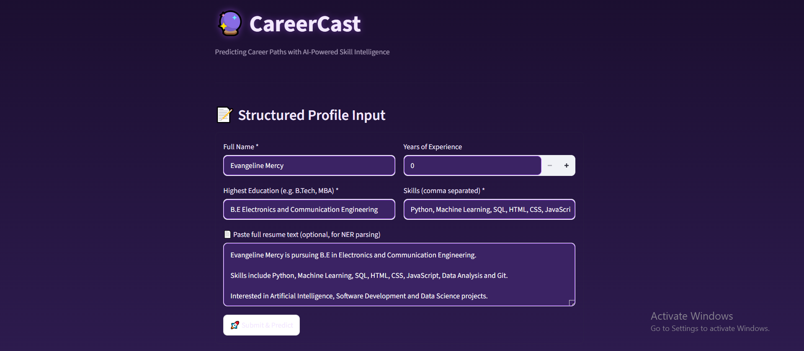
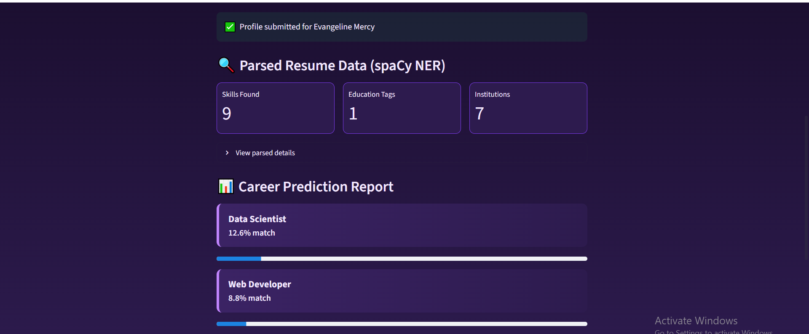
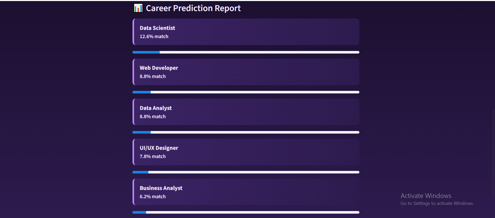

# CareerCast — Milestone 1

AI-powered career path prediction system.

## Milestone 1 Deliverables

- Resume parsing using spaCy NER (skills, education, institutions)
- Structured user-profile form with validation
- Baseline Logistic Regression classifier trained on historical career dataset
- Career prediction report with accuracy and coverage metrics

## How to run

```bash
pip install -r requirements.txt
python -m spacy download en_core_web_sm
python train_model.py
streamlit run app.py
```

## Application Screenshots

### 1. Home Page



---

### 2. User Profile Input



---

### 3. Resume Parsing



---

### 4. Career Prediction Report

